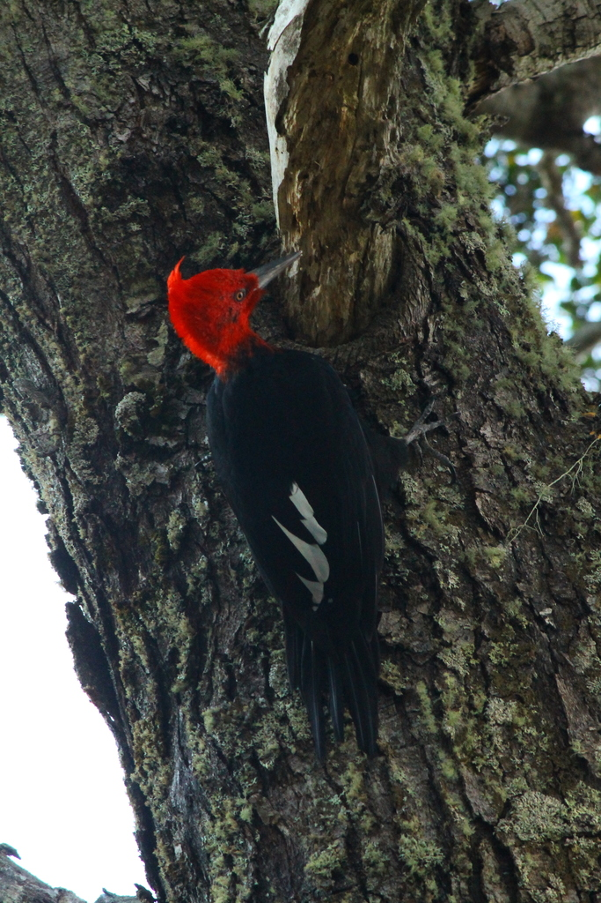

# Potencial Ornitologico Fueguino



## **Objetivos**
### Objetivo general
Descubrir los mejores sitios de la provincia de Tierra del Fuego para llevar turistas que deseen realizar observación de aves.

### Objetivos particulares
- Clasificar cada celda de la provincia de Tierra del Fuego en un cluster según las especies de aves registradas
- Identificar los sitios con mayor potencial ornitológico dentro de cada cluster


## Origen de los datos
Se trabajó con registros de especies de aves realizados en las plataformas de **ciencia ciudadana** [iNaturalist](https://www.inaturalist.org) y [eBird](https://ebird.org/). Los datos son libres y fueron solicitados a ambas plataformas. Se solicitaron todos los datos disponibles de registros de aves en la provincia de Tierra del Fuego, Argentina.

## Línea de trabajo
Cada punto indicato corresponde a un notebook con idéntica numeración

1a. Limpieza y preparación de datos obtenidos de iNaturalist
1b. Limpieza y preparación de datos obtenidos de eBird
2. Confección de la base de datos a utilizarse en la clasificación de sitios (celdas)
3. Clusterización de las celdas en base a las especies registradas
4. Detección de las mejores celdas para observación en cada cluster en base a la riqueza específica y creación de mapas.

## Resultados
- Se dividió a la provincia de Tierra del Fuego en tres clusters según las especies de aves presentes
- Se obtuvo una grilla clusterizada de la provincia
- Se destacaron los mejores sitios para observación de aves en cada cluster
- Se creó un mapa mostrando la grilla clusterizada y la riqueza relativa de cada celda

## Conclusiones

A partir de los datos obtenidos de las plataformas iNaturalist y eBird se seleccionaron los **mejores sitios** para llevar turistas que deseen observar la mayor cantidad de aves que habitan en la provincia de Tierra del Fuego en la menor cantidad de salidas posible. Si un observador de aves desea visitar Tierra del Fuego debería priorizar recorrer:
- el área costera de Bahía Ushuaia, incluyendo el área de la reserva Bahía Encerrada;
- el Parque Nacional Tierra del Fuego
- las cercanías de la ciudad de Río Grande

Tanto los notebook de este proyecto como las funciones desarrolladas *ad-hoc* pueden ser utilizados para la clasificación de sitios en **cualquier lugar del mundo**, siempre y cuando se disponga de los datos correspondientes. Solo se requiere obtener los datos de las mismas fuentes (los cuales están disponibles tras el registro) y crear un mapa de contorno del área.

### Debilidades del proyecto
- Gran cantidad de celdas no cuentan con registros en las mencionadas plataformas. Si bien zonas como península Mitre no serían visitables por su aislamiento geográfico, otras zonas al norte del lago Khami en las ceranías de la frontera cuentan con rutas de acceso y podrían presentar una mayor riqueza de especies.
- Se decidió utilizar unicamente registros de ciencia ciudadana ya que la forma de obtenerlos es similar a los medios con los que cuentan los turistas (binoculares y cámara fotográfica). Sin embargo, esta metología exluye tanto a los registros realizados por la comunidad científica como los sitios poco visitados. Con registros más completos los clusters obtenidos podrían ser ligeramente diferentes, al igual que las celdas recomendadas.


## Organización del proyecto

```
├── LICENSE            <- Open-source license if one is chosen
├── Makefile           <- Makefile with convenience commands like `make data` or `make train`
├── README.md          <- The top-level README for developers using this project.
├── data
│   ├── external       <- Data and images from third party sources.
│   ├── interim        <- Intermediate data that has been transformed.
│   ├── processed      <- The final, canonical data sets for modeling.
│   └── raw            <- The original, immutable data dump.
│
├── docs               <- A default mkdocs project; see www.mkdocs.org for details
│
├── models             <- Trained and serialized models, model predictions, or model summaries
│
├── notebooks          <- Jupyter notebooks. Naming convention is a number (for ordering),
│                         the creator's initials, and a short `-` delimited description, e.g.
│                         `1.0-jqp-initial-data-exploration`.
│
├── pyproject.toml     <- Project configuration file with package metadata for 
│                         potencial_ornitologico_fueguino and configuration for tools like black
│
├── references         <- Data dictionaries, manuals, and all other explanatory materials.
│
├── reports            <- Generated analysis as HTML, PDF, LaTeX, etc.
│   └── figures        <- Generated graphics and figures to be used in reporting
│
├── requirements.txt   <- The requirements file for reproducing the analysis environment, e.g.
│                         generated with `pip freeze > requirements.txt`
│
├── setup.cfg          <- Configuration file for flake8
│
└── potencial_ornitologico_fueguino   <- Source code for use in this project.
    │
    ├── __init__.py             <- Makes potencial_ornitologico_fueguino a Python module
    │
    ├── config.py               <- Store useful variables and configuration
    │
    ├── dataset.py              <- Scripts to download or generate data
    │
    ├── features.py             <- Code to create features for modeling
    │
    ├── modeling                
    │   ├── __init__.py 
    │   ├── predict.py          <- Code to run model inference with trained models          
    │   └── train.py            <- Code to train models
    │
    └── plots.py                <- Code to create visualizations
```

--------

