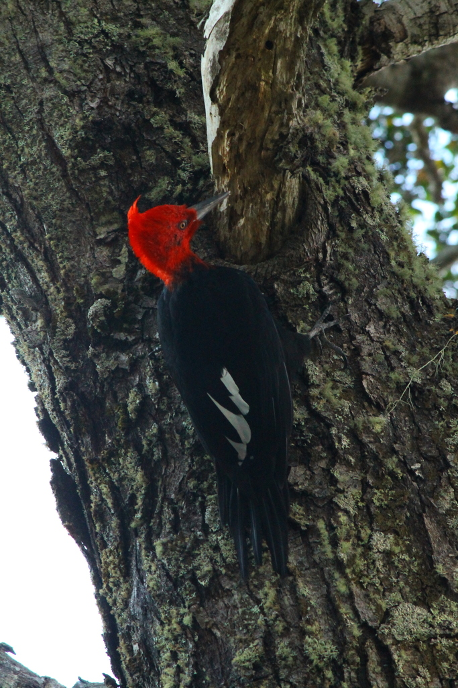
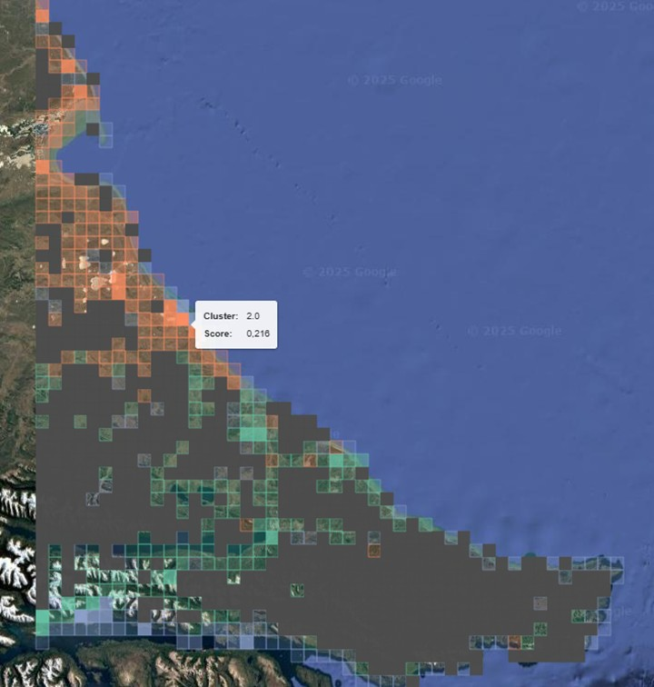
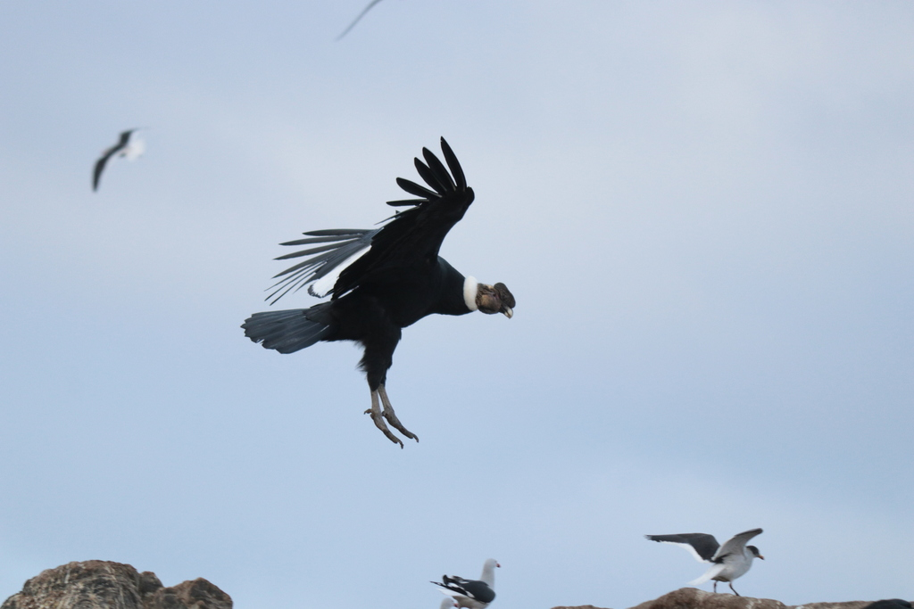

# Ornithological potential
### **Author:** Pablo Jusim



## Contents
1. [Introduction](#introduction)
2. [Objectives](#objectives)
3. [Data sources](#data-sources)
4. [Workflow](#workflow)
5. [Results](#results)
6. [Conclusions](#conclusions)
7. [Limitations](#limitations)
8. [Project structure](#project-structure)
9. [Installation & usage](#installation--usage)
10. [License](#license)
11. [Contact](#contact)

---

## Introduction
Birdwatching tourism is experiencing significant global growth. This type of tourism combines low environmental impact with the potential to generate valuable income for local communities. 

This project provides a replicable method for spatially classifying an area based on bird species richness, highlighting sites with the highest ornithological potential. Although Tierra del Fuego, Argentina, is used as an example, **the methodology can be applied to any region worldwide**, as long as the user provides the necessary observation data in the `data/external` folder.

---

## **Objectives**
### General objetive
Identify the best areas for birdwatching, based on observed species richness and the presence of rare or endemic species.

### Specific objetives
- Classify each grid cell in the area of interest into clusters according to recorded bird species.
- Detect the grid cells with the highest ornithological potential within each cluster.
- Provide spatial outputs to support sustainable birdwatching tourism planning.


---

## Data sources
The project uses bird occurrence data from **citizen science** platforms [iNaturalist](https://www.inaturalist.org) and [eBird](https://ebird.org/). These data are freely available and were requested directly from both platforms.

👉 *For your own study area, you should obtain and place the required datasets in the `data/external` folder.*

---

## Workflow
The workflow is structured in a single main notebook supported by auxiliary modules within the `ornithological_potential` Python package.

**Main steps:**
1. Data cleaning and preparation of records from iNaturalist and eBird.
2. Generation of the study grid and association of records to grid cells.
3. Clustering of grid cells based on species presence.
4. Calculation of species richness scores and identification of the best cells for birdwatching.
5. Export of maps and interactive visualisations.

## Results
- The study area was divided into clusters according to species composition.
- A clustered grid was produced, highlighting cells with higher species richness within each cluster.
- The final output includes maps and tables to guide sustainable birdwatching activities.


> *Above: Screenshot of a final clustered grid and richness scores obtained with data for Tierra del Fuego, Argentina. For the full interactive map, see `reports/figures/interactive_map.html`.*

---

## Conclusions
Using data from iNaturalist and eBird, the project identifies the **best areas** to take tourists for birdwatching with the goal of seeing as many species as possible within a limited number of trips. 

Although Tierra del Fuego was the example region, the pipeline and code are designed to be **fully reusable for any other region** with available data. Simply obtain bird occurrence records, prepare a study grid, and run the provided notebook and modules.

---

## Limitations
- Some areas within the study grid lack sufficient citizen science records. Remote or less-visited sites may be underrepresented.
- The methodology focuses exclusively on citizen science data, which means scientific observations not uploaded to these platforms are excluded. With more comprehensive datasets, cluster definitions and site recommendations could vary.
- The project does not account for seasonal variations in bird populations or migration patterns.




---

## Project structure

```
├── LICENSE            <- Open source license.
├── Makefile           <- Makefile with useful commands (optional).
├── README.md          <- Project summary. This file.
├── data
│   ├── external       <- Raw data provided by the user (iNaturalist, eBird, images).
│   ├── interim        <- Intermediate data, cleaned and transformed.
│   ├── processed      <- Final outputs (e.g., clustered grids).
│   └── raw            <- Original raw data dumps.
│
├── notebooks
|   └── Main.ipynb     <- Main notebook to run the entire workflow.
│
├── pyproject.toml     <- Project configuration file
│
├── references         <- Reference material
│
├── reports
│   └── figures        <- Generated plots and interactive maps.
│
├── setup.cfg          <- Linting and style config.
|
└── src
    └── ornithologcal_potential
        ├── __pycache__         <- Python cache files.
        ├── __init__.py         <- Package initialization.
        ├── etl_ebird.py        <- Extract, transform, load eBird data.
        ├── etl_iNat.py         <- Extract, transform, load iNat uralist data.
        ├── export_interactive_map.py   <- Export interactive map.
        ├── grid_association.py <- Associate grid cells with bird species.
        ├── grid_generation.py  <- Generate study grid.
        ├── merge_sources.py    <- Merge eBird and iNat data.
        ├── postprocess_grid.py <- Postprocess grid data.
        └── utils.py            <- General utility functions.
```

---

## Installation & usage

1. **Clone the repository**  

   ```bash
   git clone https://github.com/pablo-jusim/ornithological_potential.git
   cd ornithological_potential
   ```

2. **Create and activate a virtual environment**

    ```bash
    python3 -m venv venv
    source venv/bin/activate      # or venv\Scripts\activate on Windows
    ```

3. **Install dependencies**

    ```bash
   pip install -r requirements.txtl
   ```

4. **Add your own occurrence data**
    Place your .csv or .txt files in data/external/.

5. **Run the main notebook**
    Execute notebooks/Main.ipynb step by step to process, cluster and generate your final maps.

---

## License

This project is distributed under the MIT License.  
See [LICENSE](LICENSE) for details.

---

## Contact
📧 pablo.jusim@gmail.com


--------